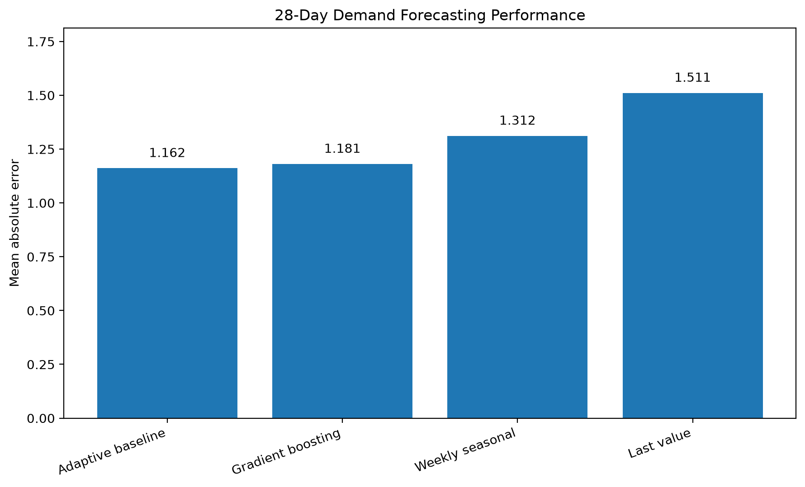
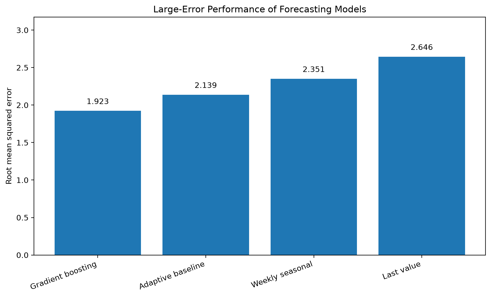
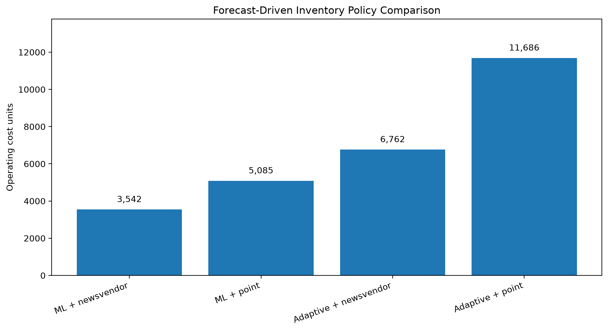
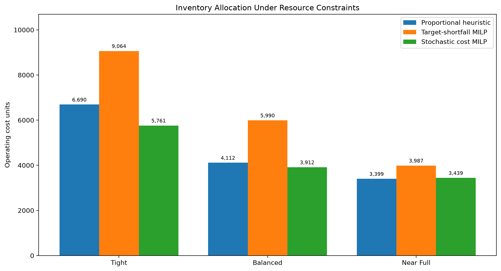
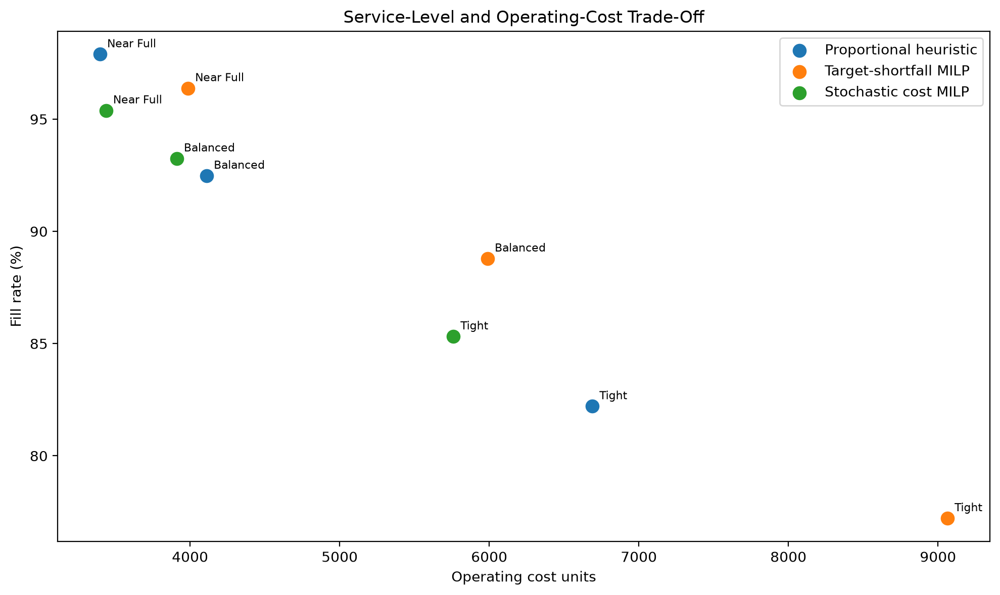

# Retail Demand Forecasting and Inventory Optimisation

An end-to-end data science and operations research project that forecasts retail demand, converts forecasts into inventory decisions, and allocates limited stock under purchasing-budget and storage-capacity constraints.

The project combines:

- SQL-based data engineering
- time-series feature engineering
- statistical forecasting
- machine-learning forecasting
- newsvendor inventory planning
- mixed-integer linear programming
- stochastic optimisation
- business-focused evaluation and visualisation

The objective is not merely to produce accurate forecasts. It is to determine which forecasting and optimisation decisions produce the best balance between customer service, stockouts, excess inventory, and operating cost.

---

## Executive Summary

Retail inventory decisions involve a fundamental trade-off:

- Ordering too little creates stockouts, lost sales, and poor customer service.
- Ordering too much creates excess stock, holding costs, and tied-up capital.

This project builds a complete decision pipeline from raw retail data to constrained inventory allocation.

### Headline results

- Gradient boosting reduced forecast RMSE by **10.06%** compared with the adaptive baseline.
- The machine-learning forecast achieved an almost unbiased result, with a bias of **0.0029**.
- A newsvendor safety-stock policy reduced operating cost by **30.34%** compared with ordering only the machine-learning point forecast.
- A stochastic expected-cost MILP reduced operating cost by **13.89%** under tight constraints.
- The stochastic MILP reduced operating cost by **4.86%** under balanced constraints.
- Under near-full resources, a simpler proportional allocation remained marginally better.

> **Business conclusion:** Stochastic optimisation adds the most value when purchasing budget and storage capacity are scarce. Simpler allocation rules can remain competitive when resource constraints are loose.

---

## Business Problem

A retailer must decide how much inventory to order before future demand is known.

Ordering too little may result in:

- stockouts;
- lost sales;
- dissatisfied customers;
- reduced service levels.

Ordering too much may result in:

- excess inventory;
- storage and holding costs;
- markdown risk;
- tied-up working capital.

This project addresses three connected questions:

1. How accurately can product-level demand be forecast over the next 28 days?
2. How should forecast uncertainty be converted into safety stock?
3. How should limited purchasing budget and storage capacity be allocated across products?

---

## Key Results

### 1. Forecasting performance

Four forecasting approaches were evaluated on an untouched 28-day holdout period:

- last-value naïve forecast;
- weekly seasonal naïve forecast;
- adaptive baseline selected through rolling backtesting;
- pooled histogram gradient-boosting model.

| Model | MAE | RMSE | Bias | WAPE |
|---|---:|---:|---:|---:|
| Adaptive baseline | **1.1616** | 2.1385 | -0.3774 | **75.15%** |
| Gradient boosting | 1.1812 | **1.9234** | **0.0029** | 76.42% |
| Weekly seasonal naïve | 1.3119 | 2.3510 | -0.2038 | 84.87% |
| Last-value naïve | 1.5114 | 2.6461 | 0.2610 | 97.78% |

Compared with the adaptive baseline, the gradient-boosting model:

- reduced RMSE by **10.06%**;
- almost eliminated systematic forecast bias;
- produced a slightly higher MAE of **1.69%**.

This means that the adaptive baseline made slightly smaller typical errors, while the machine-learning model was more effective at reducing large errors and systematic underforecasting.





---

### 2. Forecast-driven inventory planning

The forecasting models were converted into inventory decisions using two policies:

1. point-forecast ordering;
2. newsvendor-adjusted ordering with safety stock.

| Forecast and policy | Fill rate | Stockout series | Operating cost |
|---|---:|---:|---:|
| ML + newsvendor | **98.75%** | **6.00%** | **3,542** |
| ML + point forecast | 87.17% | 38.00% | 5,085 |
| Adaptive + newsvendor | 86.38% | 47.33% | 6,762 |
| Adaptive + point forecast | 65.94% | 70.67% | 11,686 |

Using machine-learning forecasts with a newsvendor safety-stock policy reduced operating cost from:

$$
5{,}085 \longrightarrow 3{,}542
$$

The corresponding percentage reduction is:

$$
\frac{5{,}085-3{,}542}{5{,}085}\times 100
=
30.34\%.
$$



---

### 3. Inventory allocation under resource constraints

The unconstrained machine-learning newsvendor plan required 9,548 units. Three resource scenarios were therefore introduced.

| Scenario | Purchasing budget | Storage capacity |
|---|---:|---:|
| Tight | 65% of unconstrained budget | 70% of unconstrained capacity |
| Balanced | 80% of unconstrained budget | 85% of unconstrained capacity |
| Near full | 95% of unconstrained budget | 95% of unconstrained capacity |

Three allocation approaches were compared:

- proportional heuristic;
- target-shortfall MILP;
- stochastic expected-cost MILP.

#### Tight constraints

| Method | Fill rate | Shortage units | Operating cost |
|---|---:|---:|---:|
| Stochastic expected-cost MILP | **85.32%** | **953** | **5,761** |
| Proportional heuristic | 82.21% | 1,155 | 6,690 |
| Target-shortfall MILP | 77.22% | 1,479 | 9,064 |

The stochastic MILP reduced operating cost by:

$$
\frac{6{,}690-5{,}761}{6{,}690}\times 100
=
13.89\%.
$$

#### Balanced constraints

| Method | Fill rate | Shortage units | Operating cost |
|---|---:|---:|---:|
| Stochastic expected-cost MILP | **93.25%** | **438** | **3,912** |
| Proportional heuristic | 92.48% | 488 | 4,112 |
| Target-shortfall MILP | 88.79% | 728 | 5,990 |

The stochastic MILP reduced operating cost by:

$$
\frac{4{,}112-3{,}912}{4{,}112}\times 100
=
4.86\%.
$$

#### Near-full constraints

| Method | Fill rate | Shortage units | Operating cost |
|---|---:|---:|---:|
| Proportional heuristic | **97.89%** | **137** | **3,399** |
| Stochastic expected-cost MILP | 95.39% | 299 | 3,439 |
| Target-shortfall MILP | 96.38% | 235 | 3,987 |

Under near-full resources, proportional allocation remained marginally better by 40 operating-cost units.





---

## Dataset

The project uses a reproducible subset of the public M5 Forecasting dataset.

The analytical subset contains:

- 50 food products;
- 3 stores: `CA_1`, `TX_1`, and `WI_1`;
- 1,941 historical days;
- 150 product-store demand series;
- 291,150 daily sales records;
- 31,207 product-store-week price records.

The final 28 days are reserved as an untouched evaluation period:

```text
2016-04-25 to 2016-05-22
```

The raw data files are not committed to the repository because of their size.

---

## Project Architecture

```text
Raw M5 data
      |
      v
Data validation
      |
      v
Analytical subset construction
      |
      v
SQLite relational database
      |
      v
SQL business analysis
      |
      v
Forecasting baselines
      |
      v
Adaptive model selection
      |
      v
Leakage-safe feature engineering
      |
      v
Recursive gradient-boosting forecasts
      |
      v
Newsvendor inventory planning
      |
      v
Budget- and capacity-constrained allocation
      |
      v
Stochastic expected-cost MILP
      |
      v
Business reports and portfolio visualisations
```

---

## Data Engineering

### Source validation

The raw-data validation stage checks:

- required files;
- expected columns;
- calendar coverage;
- day-column structure;
- price-table structure;
- sales-table dimensions.

### Analytical subset

The project uses:

- department `FOODS_3`;
- stores `CA_1`, `TX_1`, and `WI_1`;
- 50 products available across all three stores.

The subset is transformed into a relational model containing:

- `dim_items`;
- `dim_stores`;
- `dim_calendar`;
- `fact_sales`;
- `fact_prices`.

### SQLite analytical database

The relational data is loaded into:

```text
data/processed/retail_inventory.db
```

The database includes:

- primary-key constraints;
- foreign-key relationships;
- analytical indexes;
- data-integrity checks.

---

## SQL Business Analysis

The SQL layer answers questions such as:

- What is the overall dataset coverage?
- Which store sells the most units?
- Which store has the highest zero-sales rate?
- Which products generate the most demand?
- Which products generate the most estimated revenue?
- How does demand vary by month?
- How does demand vary by weekday?
- How complete is the available price information?

The queries are stored in:

```text
sql/business_queries.sql
```

Generated business tables are stored in:

```text
reports/tables/
```

---

## Forecasting Methodology

### Holdout strategy

The final 28 days are reserved as an untouched holdout period.

The model-development sequence is:

```text
Historical training data
        |
        v
Rolling backtesting and model selection
        |
        v
Final model fitting
        |
        v
Untouched 28-day evaluation
```

No random train-test split is used because random splitting would violate chronological ordering.

---

### Baseline models

The project evaluates:

- zero-demand forecast;
- last-value naïve forecast;
- weekly seasonal naïve forecast;
- trailing seven-day mean;
- trailing 28-day mean.

The weekly seasonal forecast repeats the most recent seven-day demand pattern across the 28-day forecast horizon.

---

### Adaptive model selection

A separate baseline is selected for every product-store series.

For each series:

1. the final 28 days remain untouched;
2. candidate models are evaluated across four earlier 28-day backtesting windows;
3. the model with the lowest historical MAE is selected;
4. the selected model is evaluated on the final holdout.

Almost half of the series selected a zero-demand forecast, reflecting the strongly intermittent nature of the dataset.

---

### Machine-learning model

The pooled forecasting model is:

```text
HistGradientBoostingRegressor
```

with Poisson loss.

The model is trained simultaneously across all 150 product-store series.

#### Features

The feature set includes:

- product identity;
- store identity;
- selling price;
- price-availability indicator;
- weekday cycle;
- month cycle;
- event indicator;
- SNAP indicator;
- lagged demand at 1, 7, 14, and 28 days;
- seven-day rolling mean;
- seven-day rolling standard deviation;
- seven-day zero-demand rate;
- 28-day rolling mean;
- 28-day rolling standard deviation;
- 28-day zero-demand rate;
- short-term versus long-term demand trend.

A total of 282,750 training observations and 21 model features are used.

---

### Recursive forecasting

The machine-learning model forecasts the final 28 days recursively.

The process is:

1. predict the first holdout day;
2. append the prediction to the available demand history;
3. construct the next day’s lag and rolling features;
4. predict the next day;
5. repeat for all 28 days.

Actual future holdout demand is never used to construct future lag features.

This prevents look-ahead leakage and produces a realistic multi-step forecasting evaluation.

---

## Inventory Methodology

### Point-forecast ordering

The point-forecast policy orders the rounded total predicted demand:

$$
q_i
=
\left\lceil
\widehat{D}_i
\right\rceil,
$$

where:

- $q_i$ is the order quantity for product-store series $i$;
- $\widehat{D}_i$ is predicted demand over the 28-day horizon.

---

### Newsvendor-adjusted ordering

Safety stock is added using:

$$
q_i
=
\left\lceil
\widehat{D}_i+z\sigma_i
\right\rceil,
$$

where:

- $\sigma_i$ is the estimated variability of historical 28-day demand;
- $z$ is the service factor determined by the shortage-to-holding-cost ratio.

The project assumes:

$$
c_{\text{shortage}}=5
$$

and:

$$
c_{\text{holding}}=1.
$$

The corresponding critical ratio is:

$$
\frac{c_{\text{shortage}}}
{c_{\text{shortage}}+c_{\text{holding}}}
=
\frac{5}{5+1}
=
0.8333.
$$

These values represent relative operating-cost units rather than euros or dollars.

---

## Deterministic Constrained Allocation

The first constrained MILP minimises weighted shortfalls from the unconstrained order targets.

Let:

- $t_i$ be the unconstrained target quantity;
- $q_i$ be the allocated order quantity;
- $s_i$ be the shortfall from the target;
- $c_i$ be the estimated procurement cost;
- $B$ be the available purchasing budget;
- $C$ be the available storage capacity;
- $w_i$ be a product-priority weight.

The objective is:

$$
\min_{q,s}
\sum_i w_i s_i.
$$

The model is subject to:

$$
q_i+s_i=t_i,
$$

$$
\sum_i c_iq_i\leq B,
$$

$$
\sum_i q_i\leq C,
$$

and:

$$
q_i\in\mathbb{Z}_{\geq0}.
$$

This model was feasible and mathematically correct, but it performed poorly on realised demand because its objective did not directly match the operating-cost evaluation function.

> **Modelling lesson:** A mathematically optimal solution can still be a poor business decision when the optimisation objective does not represent the true business cost.

---

## Stochastic Expected-Cost Optimisation

The improved stochastic MILP minimises expected shortage and holding costs across multiple demand scenarios.

Let:

- $q_i$ be the order quantity for item $i$;
- $u_{ik}$ be the shortage for item $i$ under demand scenario $k$;
- $o_{ik}$ be leftover inventory for item $i$ under scenario $k$;
- $d_{ik}$ be simulated demand;
- $\pi_k$ be the probability of scenario $k$;
- $c_i$ be estimated procurement cost;
- $B$ be the purchasing budget;
- $C$ be storage capacity.

The objective is:

$$
\min_{q,u,o}
\sum_k \pi_k
\sum_i
\left(
5u_{ik}+o_{ik}
\right).
$$

Shortage is represented by:

$$
u_{ik}\geq d_{ik}-q_i.
$$

Leftover inventory is represented by:

$$
o_{ik}\geq q_i-d_{ik}.
$$

The purchasing-budget constraint is:

$$
\sum_i c_iq_i\leq B.
$$

The storage-capacity constraint is:

$$
\sum_i q_i\leq C.
$$

Order quantities must be nonnegative integers:

$$
q_i\in\mathbb{Z}_{\geq0}.
$$

Five discrete demand scenarios are used:

- very low;
- low;
- central;
- high;
- very high.

Actual holdout demand is excluded from the optimisation and used only after solving to evaluate the completed allocations.

---

## Evaluation Metrics

### Forecasting metrics

#### Mean Absolute Error

$$
\operatorname{MAE}
=
\frac{1}{n}
\sum_{i=1}^{n}
\left|
\widehat{y}_i-y_i
\right|.
$$

#### Root Mean Squared Error

$$
\operatorname{RMSE}
=
\sqrt{
\frac{1}{n}
\sum_{i=1}^{n}
\left(
\widehat{y}_i-y_i
\right)^2
}.
$$

#### Bias

$$
\operatorname{Bias}
=
\frac{1}{n}
\sum_{i=1}^{n}
\left(
\widehat{y}_i-y_i
\right).
$$

A positive value indicates overforecasting, while a negative value indicates underforecasting.

#### Weighted Absolute Percentage Error

$$
\operatorname{WAPE}
=
\frac{
\sum_i
\left|
\widehat{y}_i-y_i
\right|
}{
\sum_i
\left|
y_i
\right|
}
\times100.
$$

---

### Inventory metrics

The inventory evaluation reports:

- ordered units;
- served units;
- shortage units;
- leftover units;
- fill rate;
- percentage of product-store series with stockouts;
- holding cost;
- shortage cost;
- total operating cost;
- budget utilisation;
- capacity utilisation.

The fill rate is:

$$
\operatorname{FillRate}
=
\frac{\text{served units}}
{\text{actual demand units}}
\times100.
$$

Operating cost is defined as:

$$
\text{Operating cost}
=
5\times\text{shortage units}
+
1\times\text{leftover units}.
$$

Budget utilisation is:

$$
\text{Budget utilisation}
=
\frac{\text{purchase spend}}
{\text{budget limit}}
\times100.
$$

Capacity utilisation is:

$$
\text{Capacity utilisation}
=
\frac{\text{allocated order units}}
{\text{capacity limit}}
\times100.
$$

---

## Technology Stack

- Python
- pandas
- NumPy
- scikit-learn
- SciPy
- SQLite
- SQL
- Matplotlib
- pytest
- Git
- GitHub
- Visual Studio Code

---

## Repository Structure

```text
retail-demand-inventory-optimizer/
|
|-- data/
|   |-- raw/                  # Raw M5 files, ignored by Git
|   |-- interim/              # Analytical subset, ignored by Git
|   `-- processed/            # Database, feature table, and model
|
|-- reports/
|   |-- figures/              # Portfolio visualisations
|   `-- tables/               # Analytical and model results
|
|-- sql/
|   |-- schema.sql
|   `-- business_queries.sql
|
|-- src/
|   |-- data_validation.py
|   |-- build_initial_dataset.py
|   |-- load_to_sqlite.py
|   |-- export_business_reports.py
|   |-- forecast_baseline.py
|   |-- analyze_baseline_errors.py
|   |-- adaptive_baseline.py
|   |-- build_ml_features.py
|   |-- train_ml_model.py
|   |-- evaluate_inventory_policies.py
|   |-- optimize_constrained_inventory.py
|   |-- optimize_stochastic_inventory.py
|   `-- create_portfolio_visuals.py
|
|-- tests/
|   `-- test_interim_dataset.py
|
|-- requirements.txt
|-- .gitignore
`-- README.md
```

---

## Reproducing the Project

### 1. Clone the repository

```powershell
git clone https://github.com/mhduah/retail-demand-inventory-optimizer.git
cd retail-demand-inventory-optimizer
```

### 2. Create a virtual environment

```powershell
python -m venv .venv
```

Activate it in PowerShell:

```powershell
.venv\Scripts\Activate.ps1
```

### 3. Install dependencies

```powershell
pip install -r requirements.txt
```

### 4. Add the raw M5 files

Place the following files in:

```text
data/raw/
```

Required files:

```text
calendar.csv
sales_train_evaluation.csv
sell_prices.csv
```

### 5. Run the complete pipeline

```powershell
python src\data_validation.py
python src\build_initial_dataset.py
pytest
python src\load_to_sqlite.py
python src\export_business_reports.py
python src\forecast_baseline.py
python src\analyze_baseline_errors.py
python src\adaptive_baseline.py
python src\build_ml_features.py
python src\train_ml_model.py
python src\evaluate_inventory_policies.py
python src\optimize_constrained_inventory.py
python src\optimize_stochastic_inventory.py
python src\create_portfolio_visuals.py
```

---

## Data Quality and Validation

The project includes automated or explicit checks for:

- required raw files;
- expected row and column counts;
- valid product and store dimensions;
- unique primary keys;
- unique composite keys;
- complete chronological coverage;
- nonnegative integer sales;
- foreign-key consistency;
- valid selling prices;
- complete product-store coverage;
- holdout-period isolation;
- missing feature values;
- recursive forecasting without future information;
- matching actual demand across forecast files;
- nonnegative predictions;
- budget compliance;
- capacity compliance;
- solver success;
- operating-cost identities;
- correct aggregation of store-level resource limits.

---

## Project Limitations

- The project uses a subset of the M5 dataset rather than all products and stores.
- Procurement cost is simulated as 60% of selling price because true wholesale costs are unavailable.
- Storage capacity is represented by unit count because product-volume information is unavailable.
- The stochastic demand scenarios are a discrete approximation to forecast uncertainty.
- Shortage and holding costs are relative units rather than monetary values.
- The evaluation uses one final 28-day holdout period.
- The model does not include supplier lead times, ordering cycles, or minimum order quantities.
- The current pipeline is designed as a portfolio decision-science demonstration rather than a production retail deployment.

---

## Possible Extensions

Future improvements could include:

- expanding the pipeline to all M5 products and stores;
- rolling-origin evaluation across multiple holdout periods;
- probabilistic forecasting;
- quantile gradient boosting;
- hierarchical forecast reconciliation;
- Croston-style intermittent-demand models;
- product-specific shortage and holding costs;
- supplier lead times;
- minimum order quantities;
- product-volume-based warehouse capacity;
- multi-period inventory optimisation;
- a Streamlit or Power BI decision dashboard;
- automated model retraining and monitoring.

---

## Skills Demonstrated

This project demonstrates the ability to:

- structure a complete analytics problem from raw data to business decision;
- design relational data models;
- write analytical SQL;
- build reproducible Python data pipelines;
- implement leakage-safe time-series validation;
- engineer lag, rolling, calendar, and price features;
- compare statistical and machine-learning models honestly;
- work with intermittent retail demand;
- translate forecasts into inventory decisions;
- formulate deterministic and stochastic MILPs;
- diagnose objective-function mismatch;
- validate solver output and business metrics;
- communicate technical results through business-focused visualisations;
- use Git and GitHub for version-controlled project development.

---

## Author

**Michael Hubert Duah**

M.Sc. Mathematics — Mathematical Data Science  
Georg-August-Universität Göttingen

- GitHub: [mhduah](https://github.com/mhduah)
- LinkedIn: [Michael Hubert Duah](https://www.linkedin.com/in/michael-duah-15bbab98)